# 布奇 / Bookkeeping

本产品是一款基于智能文字场景个人财务管理的应用，可通过图片识别、拍照等快捷的方式进行账单记录，通过数据分析提供有效省钱规划。让记账更便捷、更随心。

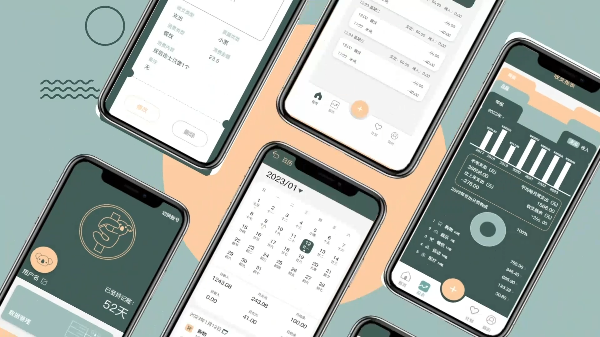

## Getting Started

This project is a starting point for a Flutter application.

A few resources to get you started if this is your first Flutter project:

- [Lab: Write your first Flutter app](https://docs.flutter.dev/get-started/codelab)
- [Cookbook: Useful Flutter samples](https://docs.flutter.dev/cookbook)

For help getting started with Flutter development, view the
[online documentation](https://docs.flutter.dev/), which offers tutorials,
samples, guidance on mobile development, and a full API reference.

## 功能描述 / Function

* 使用Flutter进行Android和iOS的跨平台开发
* 使用SqlAlchemy实现数据库交互
* 调用合合信息OCR智能文字识别接口实现拍照识别账单内容
* 使用阿里云DFSMN开源语音识别模型实现多方言的语音录入账单功能
* 基于FastText文本分类模型实现的消费信息数据自动分类
* 基于协调过滤算法实现的消费信息用户画像分析
* 基于灰色预测法实现用户的消费行为预测分析并给出合理的消费建议
* 团队原创设计的成就徽章
* 实现了柱状图、折线图、饼状图等多种报表形式
* 调用接口实现实时汇率转换

## 产品预览 / Preview

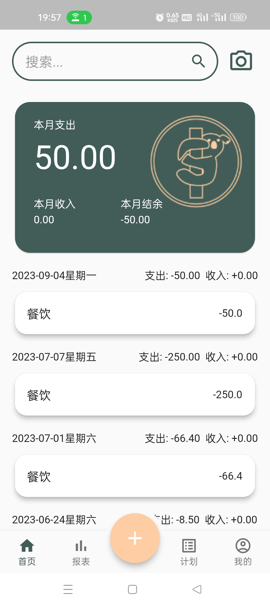
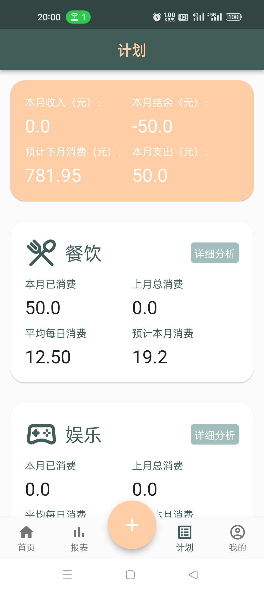
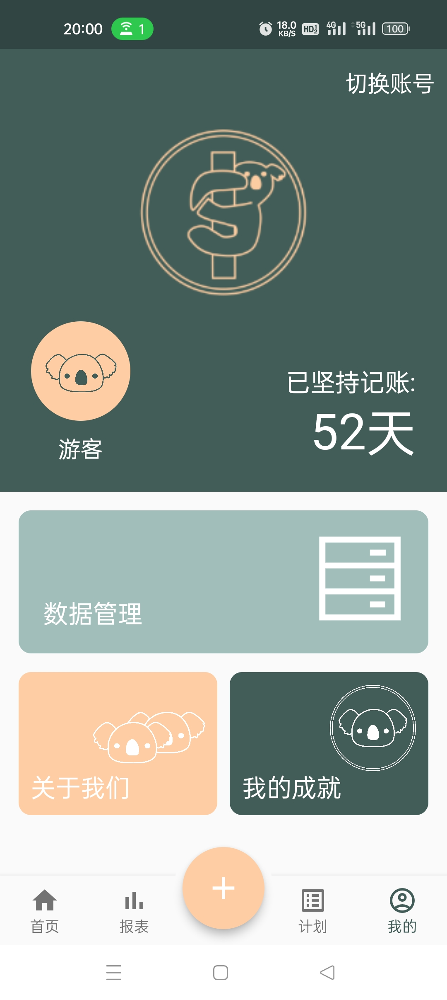
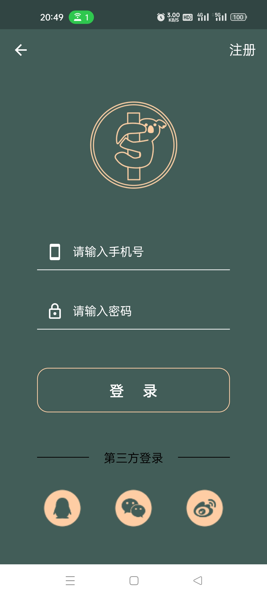
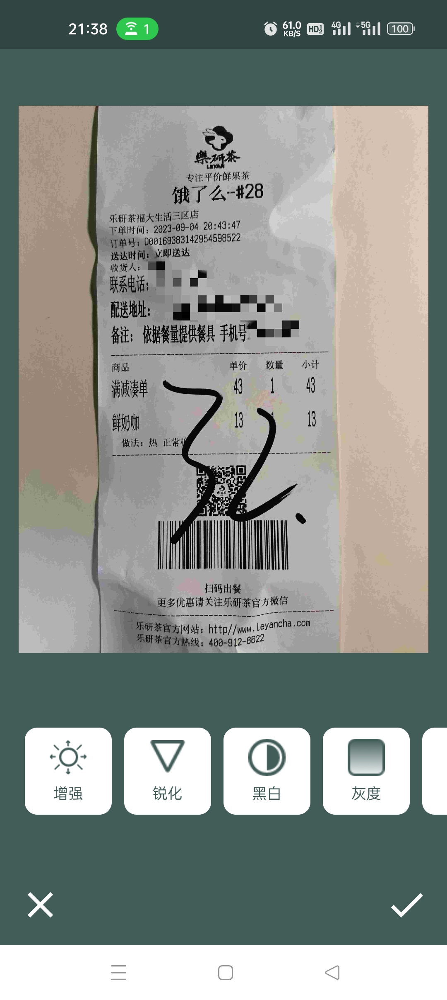
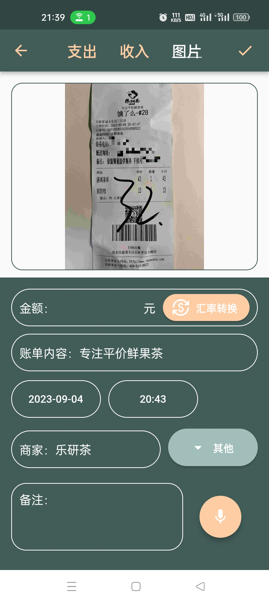
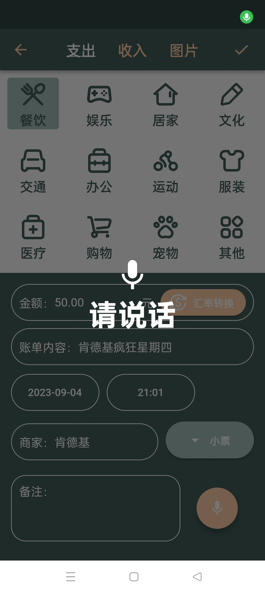
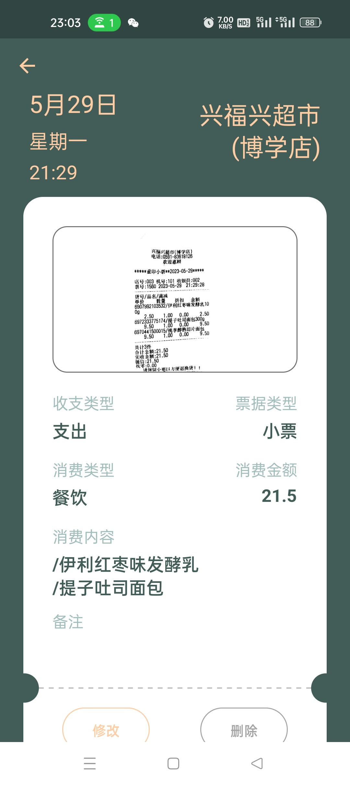
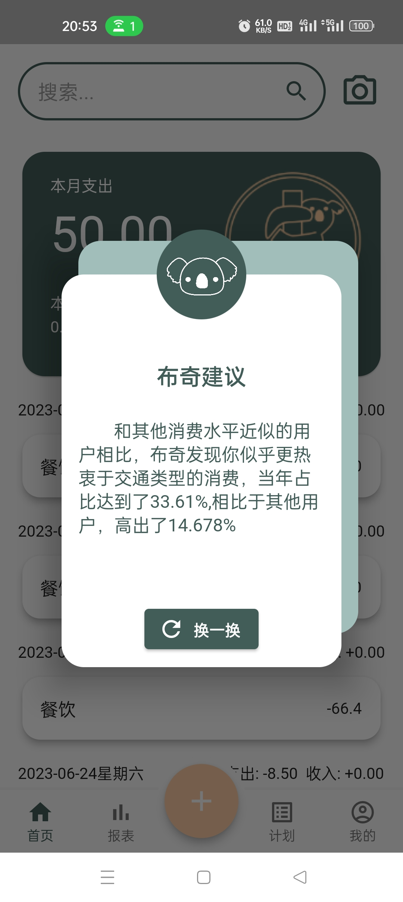
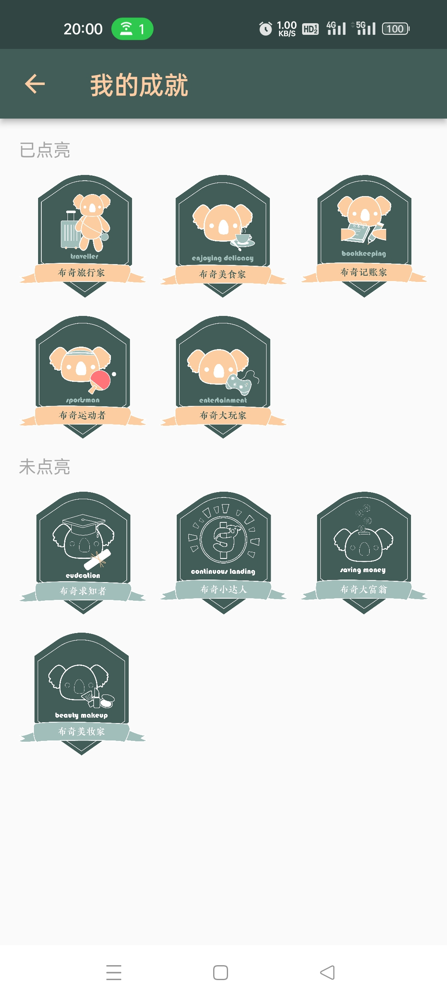
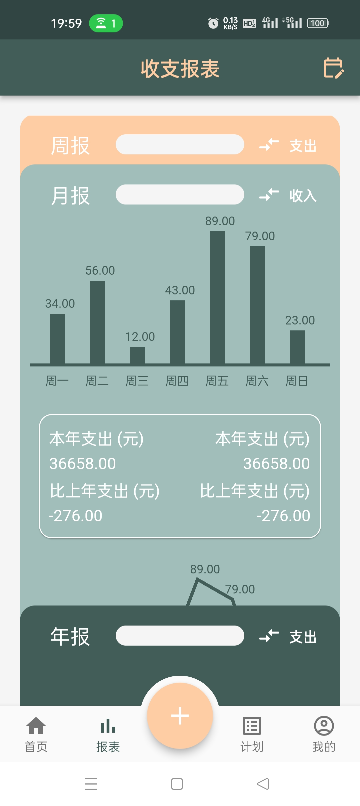
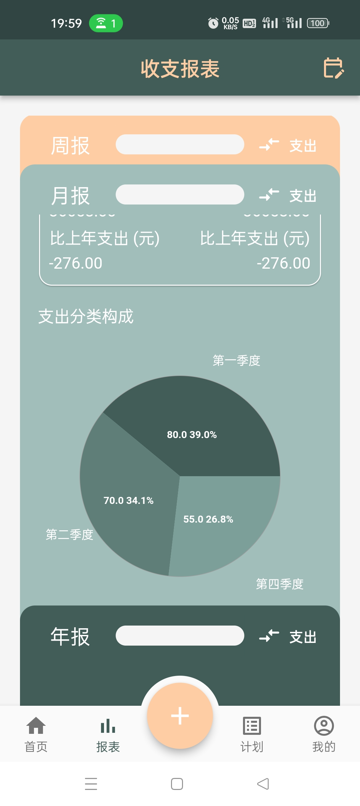
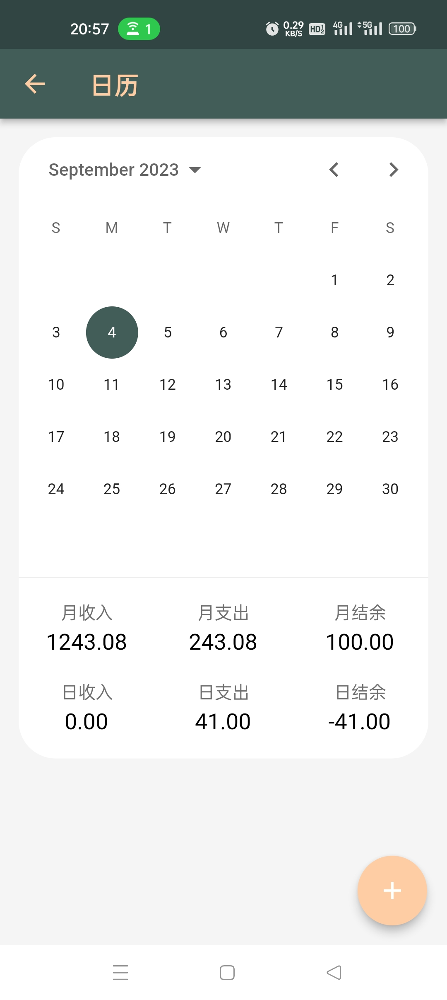
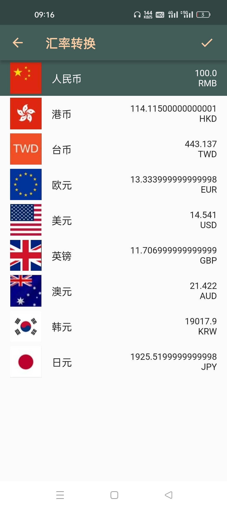

<!-- { width=50% height=auto } -->
<!-- { width=50% height=auto } -->
<!-- { width=50% height=auto } -->
<!-- { width=50% height=auto } -->
<!-- { width=50% height=auto } -->
<!-- { width=50% height=auto } -->
<!-- { width=50% height=auto } -->
<!-- { width=50% height=auto } -->
<!-- { width=50% height=auto } -->
<!-- { width=50% height=auto } -->
<!-- { width=50% height=auto } -->
<!-- { width=50% height=auto } -->
<!-- { width=50% height=auto } -->

## 安装包下载 / Install

* Android: [releases](https://github.com/PrinceSaoKe/bookkeeping/releases/download/1.0.0%2B1/bookkeeping.apk)
* iOS: 暂无

*测试手机号：13774521281*

*测试密码：123*